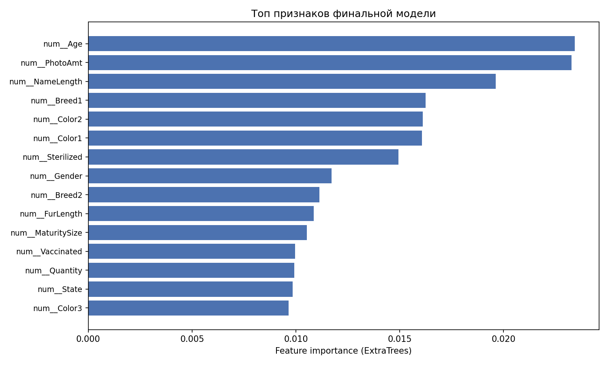
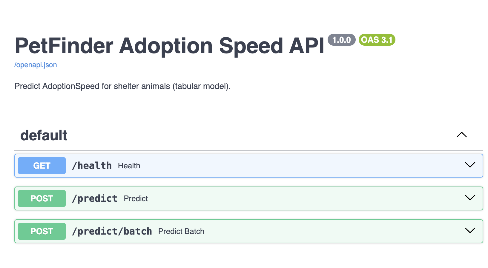
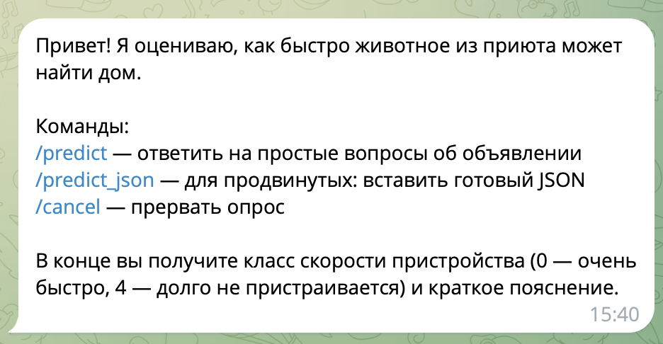

# Отчёт по проекту

**Студент:** Суслова Анастасия Алексеевна  
**Группа:** БИВ231

---

## 1. Введение и постановка задачи

- **Цель проекта:** предсказать скорость пристройства животных из приютов (`AdoptionSpeed`) по табличным признакам.
- **Формулировка задачи:** мультиклассовая классификация.
- **Обоснование метрики качества:** основной метрикой выбрана **Macro F1**, так как классы распределены неравномерно, а метрика одинаково учитывает качество по каждому классу. `Accuracy` используется как вспомогательная.

---


## 2. Поиск и описание данных

- **Источник данных:** [Kaggle PetFinder.my Adoption Prediction](https://www.kaggle.com/competitions/petfinder-adoption-prediction/data). Датасет выбран как реальная прикладная задача с разными типами признаков (числовые и категориальные).
- **Объём:** `14993` строк и `24` исходных столбца.
- **Типы признаков:** `int64` (19), `object` (4), `float64` (1).
- **Целевая переменная:** `AdoptionSpeed` (5 классов от 0 до 4).

---

## 3. Обработка и подготовка данных

- **Пропуски:** обнаружены в `Name` (`1265`, около `8.44%`) и `Description` (`13`, около `0.09%`).
- **Дубликаты:** не обнаружены.
- **Выбросы:** выбросы наблюдаются в столбцах `Breed1`, `Age`, `PhotoAmt`. Обработка выбросов не делалась для того, что бы не потерять редкие валидные значения.
- **Типы данных:** категориальные поля приведены к строковому типу для стабильной обработки.
- **Feature engineering:**
  - исходно: `24` признака;
  - добавлены признаки `NameLength`, `HasName`, `FeePerPhoto`;
  - после генерации признаков получено `27` столбцов (в признаки `X` попадает `26`, целевая переменная выделена отдельно).
- **Признаки в модели vs EDA**:
  - в **`02_preprocessing`**: `NameLength`, `HasName`, `FeePerPhoto` — для EDA, визуализаций и анализа значимости;
  - в **обучении и финальном pipeline** (`03_modeling`): только **`NameLength`** и исходные признаки; `HasName` и `FeePerPhoto` в модель **не входят**.
- **Анализ значимости признаков для таргета** (см. `notebooks/02_preprocessing.ipynb`, раздел 3.1):
  - для числовых признаков рассчитан **mutual information** с `AdoptionSpeed`;
  - наиболее информативные: `Age`, `Breed1`, `Sterilized`, `PhotoAmt`, `MaturitySize`;
  - слабые: `VideoAmt`, `Gender`; engineered-признаки на MI слабые, но `HasName` значим на уровне распределений по классам;
  - `HasName` / `NameLength` введены из-за пропусков в `Name` и гипотезы о влиянии «именованности» на пристройство;
  - `FeePerPhoto` нормирует `Fee` на `PhotoAmt` для учёта качества объявления.
- **Визуализации:** построены графики распределения таргета, boxplot для `Age` и `Fee` по классам, распределение `HasName` по `AdoptionSpeed`. **Выводы:**
  1. Классы несбалансированы (доминирует класс `2`) → обоснован Macro F1.
  2. Моложе животное — быстрее пристройство (ниже `AdoptionSpeed`).
  3. Ниже медианная `Fee` у быстрых классов; выбросы сохранены.
  4. Доля животных с именем выше у быстрых классов пристройства.
- **Split и anti-leakage:**
  - `train/val/test = 60/20/20`;
  - `random_state=42` для воспроизводимости;
  - проверена близость долей классов во всех частях выборки;
  - все трансформации (импутация, масштабирование, OneHotEncoding) обучаются только на train в составе пайплайна.

---

## 4. Baseline-модель

- **Модель:** `LogisticRegression`
- **Результаты** (см. `notebooks/03_modeling.ipynb`, leaderboard):
  - `val_accuracy = 0.425475`
  - `val_macro_f1 = 0.326685`
  - `test_accuracy = 0.426809`
  - `test_macro_f1 = 0.332581`

---

## 5. Эксперименты

Выполнено сравнение 5 моделей в `notebooks/03_modeling.ipynb`; 
для `random_forest` и `knn` применён `GridSearchCV` (cv=3, scoring=`f1_macro`). Таблица отсортирована по `val_macro_f1`.

| Модель | Гипотеза | Параметры / setup | val_accuracy | val_macro_f1 | test_accuracy | test_macro_f1 |
|--------|----------|-------------------|--------------|--------------|---------------|---------------|
| `extra_trees` | более случайный ансамбль может снизить variance | `no_tuning` | 0.437479 | **0.344473** | 0.430810 | 0.349039 |
| `random_forest` | ансамбль деревьев устойчив к шумным признакам | tuned (`max_depth`, `min_samples_leaf`, …) | 0.442147 | 0.330214 | 0.424141 | 0.340125 |
| `gradient_boosting` | последовательное бустинг-обучение даст лучший macro F1 | `no_tuning` | 0.424475 | 0.330179 | 0.421474 | 0.346062 |
| `logreg_baseline` | линейная модель задаёт нижнюю границу качества | `no_tuning` | 0.425475 | 0.326685 | 0.426809 | 0.332581 |
| `knn` | локальные соседства улучшают качество на смешанных признаках | tuned (`n_neighbors=15`, `weights`, …) | 0.369790 | 0.291337 | 0.349450 | 0.288074 |

**Гипотеза → проверка → результат:**

1. **`extra_trees`:** более случайный ансамбль снизит variance → обучение без тюнинга → лучший `val_macro_f1` (0.3445), стабильный test (0.3490).
2. **`random_forest`:** устойчивость к шумным признакам → `GridSearchCV` → macro F1 ниже, чем у `extra_trees`, но выше baseline.
3. **`gradient_boosting`:** бустинг улучшит macro F1 → без тюнинга → val на уровне RF, на test (0.3461) сопоставим с лидером.
4. **`logreg_baseline`:** нижняя граница качества → без тюнинга → подтверждена как слабейшая среди основных моделей (кроме KNN).
5. **`knn`:** локальная близость поможет → `GridSearchCV` → наименьший macro F1, гипотеза не подтвердилась.

Итог: ансамбли деревьев превосходят baseline и `KNN`; лучшая по validation — `extra_trees`.

---

## 6. Финальная модель и интерпретируемость

- **Выбранная модель:** `ExtraTreesClassifier` в sklearn `Pipeline` (препроцессинг + модель).
- **Почему выбрана:** максимальный `val_macro_f1 = 0.344473` и стабильный результат на тесте `test_macro_f1 = 0.349039`.
- **Как интерпретировать результат:** класс `AdoptionSpeed` от 0 до 4 — чем **меньше** число, тем **быстрее** пристройство (0 — в день публикации, 4 — долго не пристроилось).

### Важность признаков

Для финальной модели построен график **feature importance** (доля вклада признака в разбиениях ExtraTrees):




**Топ признаков:**

| Признак | Смысл  |
|---------|-------------------|
| `Age` | Молодые животные чаще пристраиваются быстрее |
| `Breed1` | Порода сильно влияет на спрос |
| `Sterilized` | Стерилизованные питомцы быстрее пристраиваются |
| `PhotoAmt` | Больше фото — выше внимание к объявлению |
| `MaturitySize` | Размер/зрелость связан с типичным спросом |
| `Fee` | Необходимость оплаты может замедлять пристройство |
| `NameLength` | Наличие имени (через длину) слегка связано с пристройством. Возможно, людям нравятся длинные и вычурные имена и наличие такого имени у животного увеличивает его привлекательность для будущих хозяев |

Вывод: модель опирается на **возраст, породу, медицинский статус и качество объявления** — это совпадает с выводами EDA в `02_preprocessing.ipynb`.

---

## 7. Деплой

### Запуск

```bash
pip install -r requirements.txt
python scripts/build_defaults.py   # один раз, если нет feature_defaults.json

# API
uvicorn app.main:app --reload --host 0.0.0.0 --port 8000

# Telegram (токен в .env)
cp .env.example .env
python -m app.telegram_bot
```

### Эндпоинты API

| Метод | Путь | Описание |
|-------|------|----------|
| GET | `/health` | Статус и путь к модели |
| POST | `/predict` | Предсказание для одной записи |
| POST | `/predict/batch` | Пакет предсказаний |
| GET | `/docs` | Swagger UI |


### Telegram-бот

| Команда | Действие |
|---------|----------|
| `/start` | Справка |
| `/predict` | Диалог: Type, Age, Breed1, …, Name (остальное — из `models/feature_defaults.json`) |
| `/predict_json` | Полный JSON как в API |
| `/cancel` | Отмена диалога |

### Скриншоты

Сваггер с API:


Первое сообщение бота:


Результат предсказания:


### Видео

**Ссылка на демонстрацию:** `report/assets/Screen Recording 2026-05-26 at 15.39.50.mov`

---

## 8. Заключение и выводы

В заключение могу сказать, что по итогу работы я написала программу по предсказанию скорости пристройства животных из приюта. Выяснила, что больше всего на скорость "усыновления" вылияют возраст, порода, стерилизация и фотографии. Что логично, я бы тоже себе животное по этим критериям выбирала) Запустила программу в виде тг-бота и очень рассчитываю на высокий балл))
